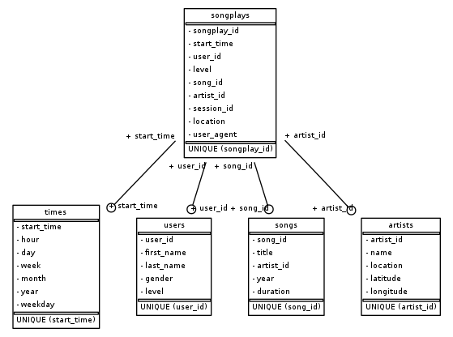

# Song Play ETL Project

## Summary

This project consists in reading song data from a subset of data from the [Million Song Dataset](https://labrosa.ee.columbia.edu/millionsong/) as well as user activity logs from a music streaming app and combine these for analytics purposes in a PostgreSQL database in the following star schema:

##### Fact Table

1. songplays
   * records in log data associated with song plays i.e. records with page `NextSong`
     * *songplay_id, start_time, user_id, level, song_id, artist_id, session_id, location, user_agent*

##### Dimension Tables

1. times
   - timestamps of records in **songplays** broken down into specific units
     - *start_time, hour, day, week, month, year, weekday*
2. users
   * users in the app
     * *user_id, first_name, last_name, gender, level*
3. songs
   * songs in music database
     * *song_id, title, artist_id, year, duration*
4. artists
   * artists in music database
     * *artist_id, name, location, latitude, longitude*



## Files description

1. `create_tables.py` drops and creates the relevant tables in the database. This script is used to reset tables before running the ETL script.
2. `sql_queries.py` contains all SQL queries used in this project.
3. `etl.ipynb` reads and processes a single file from `data/song_data` and `data/log_data` and loads the data into the tables. This notebook was meant for iteratively writing and testing code before implementing its final version into `etl.py`.
4. `etl.py` reads and processes files from `data/song_data` and `data/log_data` and loads them into the tables.
5. `test.ipynb` displays the first few rows of each table for testing purposes.

## How to run this project

```bash
python create_tables.py
python etl.py
```

After the scripts have run, you can execute `test.ipynb` for testing purposes.